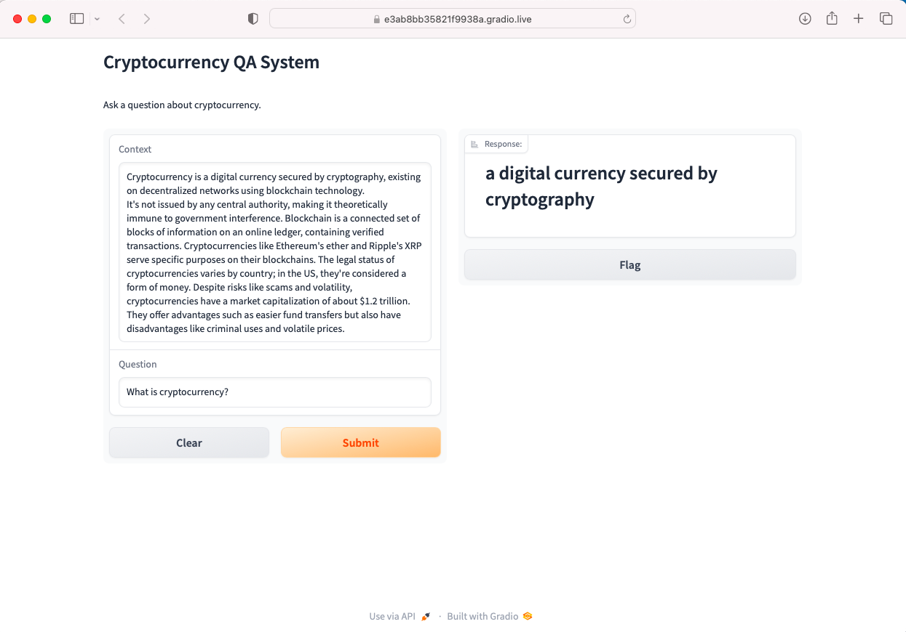

# **Question Answering System using Gradio's Lower-Level API**

## Overview

This project implements a question answering system using Gradio's lower-level API. The system features two input fields: one for the context and another for the user's question. The system then outputs the model's response.

## Dataset

The project uses the deepset/roberta-base-squad2 model for question answering.

## Methodology

The methodology for implementing the question answering system includes:

- Installing the required libraries: Gradio and transformers.
- Loading the question-answering pipeline using the deepset/roberta-base-squad2 model.
- Defining the interface components: Textbox for context, Textbox for question, and Label for displaying the model's response.
- Creating the Gradio interface with the defined components and launching it.

## Setup

To run the question answering system locally, follow these steps:

1. Install the required libraries:


   ```bash
   pip install gradio transformers
   
2. Import the necessary libraries and load the question-answering pipeline.


## Conclusion

The question answering system using Gradio's lower-level API provides a simple and user-friendly interface for interacting with the deepset/roberta-base-squad2 model. This system can be further enhanced with additional features and improvements.


### Gradio Website Screenshot

This screenshot demonstrates the functionality of the question answering system on the Gradio website, showcasing how the system processes questions and provides answers.




